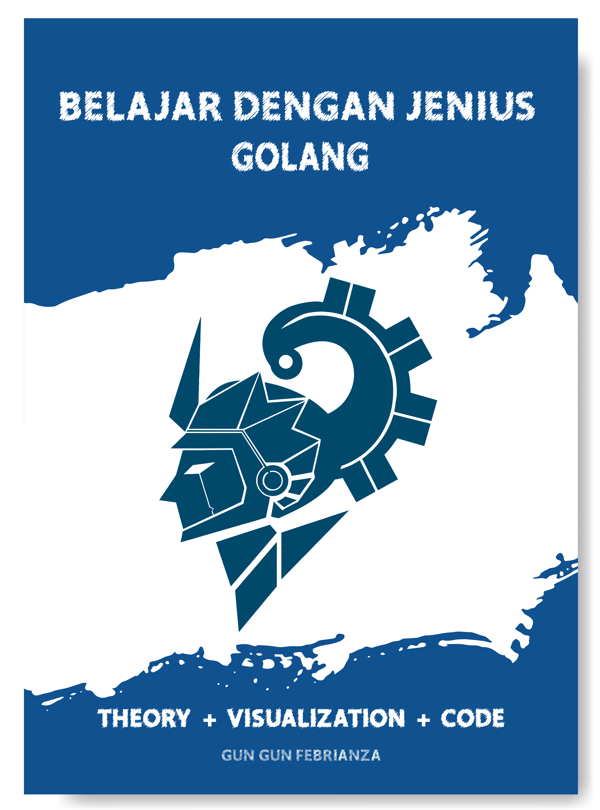
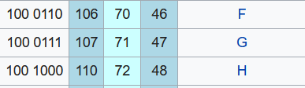

<<<<<<< HEAD
# Untitled

## _Chapter_ 1

## _Computer_

## _Subchapter_ 1 – Komputer & Pemograman

_**Subchapter**_ **1 –** _**Objectives**_

* Mengenal _**Computer Program**_
* Mengenal _**Computation**_
* Mengenal _**Computer**_ _**Organization**_
* Mengenal _**Data**_ _**Hierarchy**_
* Mengenal Klasifikasi Bahasa Pemrograman

Komputer dapat melakukan kalkulasi dan _logical decision_ dengan kecepatan yang sangat tinggi melampaui kemampuan manusia. Rata-rata _**Personal Computer**_ **\(PC\)** hari ini dapat mengeksekusi milyaran instruksi setiap detik, namun _**Supercomputer**_ dapat mengeksekusi instruksi mencapai _**Quadrillion**_ per detik atau setara dengan ribuan trilyun per detik. Sangat mencengangkan.

Salah satu _supercomputer_ bernama **Tianhe-2** yang dikembangkan oleh _National University of Defense Technology_, mampu melakukan **33** _**Quadrillion**_ kalkulasi per detik. _Approximately_, \(33,86 _Petaflops_\). Namun kompetisi pembangunan _supercomputer_ kembali dimenangkan oleh Amerika Serikat setelah mereka membuat _supercomputer_ terbaru dengan nama Summit \(OLCF-4\) yang memiliki kemampuan sampai 200 _Flops_.

_**Flops**_ atau _floating point operations per second_ adalah salah satu ukuran yang digunakan untuk mengetahui _performance_ suatu komputer. Digunakan untuk melakukan _scientific computation_ yang dapat membuka potensi bisnis bernilai ratusan juta _dollar_, inovasi dan revolusi industri yang dapat membawa suatu perusahaan atau negara membuka sejarah baru.

### _Computer Program_

Komputer memproses sebuah program yang terdiri dari serangkaian instruksi untuk melakukan suatu komputasi \(_Computation_\) secara spesifik. Kata spesifik mengacu pada suatu _problem domain_ atau _programming domain_, menurut Robert W.Semesta dalam bukunya yang berjudul Concept of Programming Language \(2016\) sebuah _programming domain_ terdiri dari 4 hal yaitu untuk :

1. _Scientific Application_

 Program yang dibuat untuk keperluan sains dan penelitian.

2. _Business Application_

 Program yang dibuat untuk keperluan bisnis.

3. _Artificial Intelligence_

 Program yang dibuat memiliki kemampuan kecerdasan buatan.

4. _Web Software_

 Program yang dibuat menggunakan teknologi web.

### _Computation_

Kata Komputasi bisa berupa _numeric computation_ seperti memecahkan sesuatu dengan model matematis seperti pada _system of equation_ \(sistem persamaan\) atau _symbolic computation_ seperti melakukan pencarian pada sebuah teks, memanipulasi teks, gambar dan vidio.

### _Computer Organization_

Komputer terdiri dari sekumpulan _logical unit_ :

#### _Input Unit_

Terdiri dari sekumpulan _**input device**_ untuk memproduksi informasi yaitu _keyboard, touchscreen, webcam, microphone, barcode scanner_ dan _mouse devices._

#### _Output Unit_

Terdiri dari sekumpulan _**output device**_ untuk menampilkan informasi yaitu _screen monitor, speaker, printer_ hingga ke _oculus rift_.

#### _Memory Unit_

_Memory unit_ seringkali disebut _memory, primary memory_ atau _**RAM \(Random Access Memory\).**_ Informasi yang tersimpan dalam _memory unit_ bersifat _**volatile**_, artinya informasi akan hilang jika komputer dimatikan.

_Memory unit_ menjadi tempat untuk mempertahankan informasi setelah melalui _input unit_, sehingga langsung tersedia untuk diproses oleh _processor_ jika dibutuhkan untuk memproduksi hasil pada _Ouput Unit_.

#### _Arithmetic and Logic Unit \(ALU\)_

Fungsi dari _ALU_ adalah untuk melakukan kalkulasi seperti penjumlahan, pengurangan, perkalian dan pembagian.

_ALU_ memiliki mekanisme untuk membuat keputusan yang dapat membuat komputer misal, membandingkan dua buah data dalam _memori unit_ apakah data tersebut setara \(_equal_\) atau tidak.

Kini ALU \(_Arithmetic and Logic Unit_\) dikembangkan sebagai _next logical unit_ untuk _CPU_.

#### _Central Processing Unit \(CPU\)_

_CPU_ \(_Central Processing Unit_\) akan memberi sinyal pada _input unit_ saat informasi dalam _memory unit_ dibutuhkan untuk diproses melakukan suatu kalkulasi dan memberikan sinyal kepada _output unit_ saat informasi dalam _memory unit_ siap untuk digunakan pada _output device_.

Kebanyakan komputer hari ini telah memiliki lebih dari satu _CPU_ sehingga dapat melakukan banyak sekali operasi secara simultan. Sebuah _Multi-core processor_ memiliki lebih dari satu _processor_ dalam satu _**IC Chip**_ tunggal.

Sebagai contoh _dual-core processor_ artinya terdapat dua _processor_ dalam 1 _IC Chip_ dan _quad-core_ artinya terdapat 4 _processor_ dalam 1 _IC Chip_.

#### _Secondary Storage Unit_

Sebuah data atau program yang sudah tidak lagi aktif digunakan biasanya akan atau dapat disimpan kedalam _storage devices_ seperti _hard drive_, sampai data tersebut dibutuhkan kembali.

Informasi yang tersimpan di dalam _secondary storage device_ bersifat persisten. Informasi tetap terjaga meskipun komputer dimatikan. Informasi yang dapat disimpan dalam _hard drives_ dalam _dekstop_ komputer bisa sangat besar melebihi 16 _Terabyte_.

### _Data Hierarchy_

Data yang akan diproses oleh komputer memiliki bentuk data hirarki, mulai dari yang paling kecil dan tidak dapat dibagi yaitu bits sampai ke dalam bentuk yang lebih kompleks

#### _Bit_

Bit adalah kependekan dari _**Binary Digit**_, unit terkecil sebuah informasi dalam mesin komputer. Satu buah _bit_ dapat menampung dua nilai diantaranya adalah **0** atau **1**.

Jika terdapat 8 _bit_ maka kita dapat menyebutnya sebagai **1** _**byte**_.

#### _Byte_

_Byte_ adalah kependekan dari _**Binary Term**_, sebuah unit penyimpanan yang sudah memiliki kapabilitas paling sederhana untuk menyimpan sebuah karakter tunggal.

1 _byte_ = sekumpulan _bit_ \(terdapat delapan bit\). Contoh : 0 1 0 1 1 0 1 0

1 _byte_ dapat menyimpan karakter contoh : 'A' atau 'x' atau '$'

#### _Bytes_

_Byte_ adalah unit yang dipat digunakan untuk menyimpan informasi, seluruh penyimpanan diukur menggunakan _bytes_.

Tabel 1 Memory Standard Metrics

| _**Number of Bytes**_ | _**Unit**_ | _**Representation**_ |
| :--- | :--- | :--- |
| 1 | _Byte_ | _One Character_ |
| 1024 | _KiloByte \(Kb\)_ | _Small Text In notepad_ |
| 1,048,576 | _MegaByte \(Mb\)_ | _Ebook_ |
| 1,073,741,824 | _GigaByte \(Gb\)_ | _Movie_ |
| 1,099,511,627,776 | _TeraByte \(Tb\)_ | _Archive_ |
| _Approximately_ 1015 | _PetaByte \(Pb\)_ | _Big Data_ |
| _Approximately_ 1018 | _ExaByte \(Eb\)_ | _Big Data_ |
| _Approximately_ 1021 | _ZettaByte \(Zb\)_ | _Big Data_ |

#### _Character_

Data dalam bentuk _bits_ tidak mudah untuk dikelola sehingga perlu bentuk lain yang dapat digunakan manusia dan mempermudah proses pengelolaan informasi. Untuk mewujudkan hal tersebut data dalam _bits_ harus bisa direpresentasikan dalam bentuk _character_. Seperti _decimal_ _digit_ \(0-9\), _letter_ \(A-Z dan a-z\), dan _special symbol_ \(!@\#$%^&\*\(\)-=\_+\). _Digit, letter_ dan _symbol_ disebut dengan _characters_.

_**Characters Set**_ adalah sekumpulan _characters_ yang digunakan untuk menulis program dan merepresentasikan sebuah informasi. Dikarenakan komputer memproses informasi dalam bentuk 1 dan 0, maka sebuah _character_ dapat direpresentasikan menggunakan 1 dan 0.

_Character_ adalah unit terkecil dalam sistem teks dan memiliki makna.

Sekumpulan _character_ dapat membentuk _string_ yang selanjutnya dapat digunakan untuk memvisualisasikan suatu bahasa verbal secara digital. Contoh _character_ adalah abjad, angka dan simbol lainya.

Gambar 1 Grapheme

**ASCII**

Komputer merepresentasikan sebuah data dengan _number_, di awal pengembangan komputer tepatnya sekitar tahun 1940. Penggunaan teks dalam komputer untuk disimpan dan dimanipulasi dapat dilakukan, dengan cara merepresentasikan abjad dalam alfabet menggunakan _number_. Sebagai contoh angka 65 merepresentasikan huruf A dan angka 66 merepresentasikan huruf B hingga seterusnya.

Pada tahun 1950 saat komputer sudah semakin banyak digunakan untuk berkomunikasi, standar untuk merepresentasikan _text_ agar dapat difahami oleh berbagai model dan _brand_ komputer diusung.

_ASCII_ \(_American Standard Code for Information Interchange_\) adalah karya yang diusung, pertama dipublikasikan pada tahun 1963. Saat pertama kali dipublikasikan _ASCII_ masih digunakan untuk _teleprinter technology_. _ASCII_ terus direvisi hingga akhirnya _7-bit ASCII Table_ diadopsi oleh _American National Standards Institute_ \(_ANSI_\).

Dengan _7-bit_ maka terdapat 128 _unique binary pattern_ yang dapat digunakan untuk merepresentasikan suatu karakter. Kita dapat merepresentasikan _**alphanumeric**_ \(abjad a-z, A-Z, angka 0-9, dan _special character_ seperti “!@\#$%^&\*”\).

Pada gambar di bawah ini huruf kapital G memiliki representasi dalam bentuk biner 100 0111 \(7 _binary digit_\) dan huruf kapital F memiliki representasi dalam bentuk _binary pattern_ 100 0110 :

Gambar 2 Sample ASCII Code

Pada huruf kapital G angka 107 adalah representasi dalam _octal numeral system_, angka 71 adalah representasi dalam _decimal numeral system_ dan angka 46 adalah representasi dalam _hexadecimal_. Representasi tidak hanya dalam bentuk _binary_. Untuk _table ASCII_ lebih lengkapnya anda dapat melihat di wikipedia.

#### _Field_

Gambar 3 Data Hierarchy

_Character_ hanya merepresentasikan sekumpulan _bit_, _field_ merepresentasikan serangkaian _character_ atau _bytes_ yang memiliki makna lebih luas. Misal sebuah _field_ dapat digunakan untuk merepresentasikan nama seseorang atau umur seseorang.

#### _Record_

Beberapa _field_ yang saling berhubungan atau memiliki kesamaan dapat digunakan untuk membangun suatu _record_. Misalkan dalam sistem kependudukan, anda tentu memiliki beberapa _fields_ diantaranya adalah nama, tempat & tanggal lahir, jenis kelamin, status dan sebagainya. Ketika masing-masing _field_ terisi maka kita akan membentuk suatu _record_.

#### _Files_

Secara umum sebuah _file_ dapat berupa _**arbitrary data**_ dengan _**arbitrary format**_. Sebagai contoh dengan _**notepad.exe**_ kita dapat membuat sebuah tulisan berisi _**plaintext**_ kemudian menyimpanya ke berbagai format seperti, **.txt, .md, .html** atau bahkan menyimpanya dengan format yang tidak dikenali oleh program dalam suatu sistem operasi \(misal dengan format .**xxxasdqwe**\).

Di beberapa sistem operasi sebuah _file_ dikatakan dengan serangkaian _bytes_ yang membentuk suatu _file_.

#### _Database_

_Database_ adalah sekumpulan data yang teroganisir dengan baik agar bisa diakses dan dimanipulasi. Model pembuatan _database_ yang paling terkenal adalah _relational database_, data disimpan ke dalam sebuah _table_ yang berisi _record_ dan _fields_.

#### _Big Data_

_**Big Data**_ adalah terminologi yang menjelaskan sebuah fenomena data dengan _volume_ yang sangat besar \(_High Volume Data_\), data dengan struktur yang bervariasi \(_High Varied Data_\) dan data diproduksi dengan kecepatan yang sangat tinggi \(_High Velocity Data_\).

Ketersediaan internet, kecepatan internet, _web application_ dan produksi perangkat elektronik seperti _smartphone_, komputer, laptop dan _tablet_ menciptakan ledakan data dengan pertumbuhan yang sangat cepat.

Gambar 4 Facebook Monthly Active User \[1\]

Dengan 2,4 milyar pengguna aktif pada kuarter kedua tahun 2019 _facebook_ menjadi _platform_ jejaring sosial \(_social media_\) terbesar didunia. Sebuah _platform social media_, dapat memproduksi berbagai jenis data seperti gambar \(_image_\), vidio \(_video_\), teks \(_text_\) dan suara \(_voice_\) dengan kecepatan yang sangat tinggi.

### _Operating System_

Sistem operasi adalah program yang mengendalikan perangkat keras komputer dan sumber perangkat lunak yang ada di dalamnya, serta menyediakan layanan umum untuk program program yang ada di dalam komputer.

Terdapat banyak sekali sistem operasi yang ada hari ini mulai dari sistem operasi _Unix_, _Windows_, _Linux_, OS X dan sebagainya. Masing masing sistem operasi memiliki kelebihan dan kekurangan. Saat ini sistem operasi telah didominasi oleh 32 Bit dan 64 Bit _Operating System_.

Pada sistem operasi 32 bit penggunaan kapasitas RAM dibatasi sampai 4096 MB RAM, 232 = 4,294,967,296 _bytes_ untuk setiap _process_. Pada sistem operasi 64 bit penggunaan kapasitas RAM dibatasi sampai 16 Exabytes 264 = 18,446,744,073,709,551,616 _bytes_.

### _Programming Language_

Selalu ingat, komputer hanya memahami satu bahasa yaitu _**Machine Language**_.

Bahasa pemrograman adalah bahasa formal untuk mengekspresikan suatu komputasi yang akan dikerjakan oleh sebuah mesin yaitu komputer. Bahasa formal adalah bahasa yang didesain secara khusus oleh seseorang untuk _specific applications_.

Bahasa pemrograman secara tradisional dilihat dari tiga segi aspek : \[2\]

1. _Syntax_ sebagai struktur dari bahasa pemrograman.

2. _Semantic_ sebagai makna dari bahasa pemrograman.

3. _Pragmatic_ sebagai implementasi dari bahasa pemrograman.

Bahasa pemrograman di desain _**human-readable**_ untuk mempermudah kita dalam memberikan instruksi kepada mesin komputer. Dalam pemograman terdapat dua cara untuk menterjemahkan ke dalam bahasa mesin yaitu :

1. Menggunakan _**Interpreter**_
2. Menggunakan _**Compiler**_

### _Programming Language Abstraction_

Berdasarkan abstraksi, bahasa pemrograman bisa diurut menjari tiga kategori yaitu _Machine Language_, _Assembly Language_ dan _High Level Language_ \[3\]. Berdasarkan _translator_ terdapat dua bahasa pemrograman yaitu _Compiled Language_ dan _Interpreted Language_.

#### _Machine Language_

_**Machine Language**_ adalah bahasa yang mampu difahami secara langsung oleh mesin komputer. _**Machine code**_ atau _Machine Language_ adalah sekumpulan instruksi atau _set of instruction_ yang langsung dieksekusi oleh _CPU_ \(_Central Processing Unit_\).

Seluruh instruksi informasinya direpresentasikan dalam bentuk angka 1 dan 0 yang diterjemahkan dengan sangat cepat oleh komputer. Sebuah program yang dibuat dengan bahasa pemrograman _high level_ harus diterjemahkan terlebih dahulu kedalam _form_ yang bisa difahami oleh suatu mesin komputer.

_**Machine Language**_ memiliki karakteristik _**Machine Dependant**_, bahasa mesin tertentu hanya dapat berjalan pada mesin komputer tertentu. Sebab setiap _processor_ atau _processor family_ memiliki _**Instruction Set Architecture**_ yang berbeda-beda.

_Machine code_ bersifat _platform-specific_, sehingga jika dikompilasi pada sistem operasi _windows_ x86 maka program hanya akan berjalan pada sistem operasi _windows_ x86.

Gambar 5 Language Abstraction

#### _Assembly Language_

_**Assembly Language**_ adalah bahasa yang mempermudah para _programmer_ agar mereka bisa terfokus memecahkan masalah daripada fokus pada mengingat formula 1 dan 0. Bahasa ini dikenal dengan sebutan _**Second Generation Language**_ atau disingkat dengan sebutan _asm_.

Bahasa ini hampir dekat dengan bahasa mesin dengan ciri khas _mnemonic_ pada setiap _syntax_ bahasa _assembly_. Seperti _syntax Add_ \(kependekan dari _addition_\), _Sub_ \(kependekan dari _subtraction_\), _Sum_ \(_summarize_\) dan sebagainya berikut dengan _storage location_. Sehingga tidak lagi bermain di _level_ _binary digit_.

Setiap instruksi memiliki tujuan spesifik untuk melaksanakan suatu tugas, seperti _load_, _jump_ atau _ALU_ \(_Arithmetic Logic Unit_\) _operation_ seperti _arithmetic operation_ \(_ADD, SUBTRACT, INCREMENT, DECREMENT_ dan lain-lain\) atau _logic operation_ \(AND, OR, XOR dan lain lain\) di dalam sebuah _CPU Register_ atau _Memory_.

Sebuah _program_ yang diberi nama _**Assembler**_ digunakan untuk menerjemahkan _assembly language_ ke _machine language._ Program yang dibuat menggunakan _assembly language_ bersifat _machine dependent_ yaitu selalu mengacu kepada sebuah tipe _CPU_. Setiap

_CPU_ memiliki _machine language_ sendiri dan di _level_ yang lebih tinggi juga memiliki _assembly language_ sendiri.

#### _High Level Language_

_High Level Language_ disebut juga _**Machine Independant Language**_ dikenal dengan sebutan _third generation language_. _High Level language_ adalah bahasa pemrograman dengan _strong abstraction_ dari kedetailan tentang komputer. Diciptakan untuk menyederhanakan pemrograman.

Abstraksi ini membuat proses pengembangan sebuah _program_ menjadi lebih sederhana dan prosesnya mudah difahami. Jumlah abstraksi yang disediakan menjelaskan seberapa tinggi level pemrograman itu sendiri.

Pada Tahun 1960, bahasa pemrograman tingkat tinggi yang menggunakan _compiler_ dikenal dengan sebutan _Autocodes_ \[4\]. Contoh _Autocodes_ adalah _Fortran_ dan _Cobol_. Bahasa pemrograman tingkat tinggi pertama didunia adalah _Plankalkül_ yang dibuat oleh Konrad Zuse \[5\].

_High Level Language Programming_ seperti bahasa C, C++, _Python_ dan _Java_ mempunyai satu ke banyak \(_one to many_\) relasi dengan _Assembly_ _Language_ dan _Machine_ _Language_. Disinilah kedalaman _abstraction_ dari sebuah bahasa tingkat tinggi dinilai. Sebuah _Statement_ satu baris yang dibuat menggunakan C++ akan mengembang jika diterjemahkan kedalam _Assembly_ _Language_ dan _Machine-language Instruction_**.**

Di bawah ini adalah dua buah _statement_ dengan C++ _code_ yang di dalamnya terdapat _Arithmetic Operation_ dan hasilnya ditetapkan kedalam sebuah _Variable_ dengan asumsi X dan Y adalah _Integer_ :

int Y;

int X = \(Y + 4\) \* 3;

Jika diterjemahkan kedalam _Assembly Language_ maka dibutuhkan banyak _statement code_ seperti di bawah ini.

mov eax,Y ; Pindahkan Y ke EAX register

add eax,4 ; Tambah nilai 4 ke EAX register

mov ebx,3 ; Pindahkan 3 ke EBX register

imul ebx ; Kalikan EAX dengan EBX

mov X,eax ; Pindahkan EAX ke X

Selanjutnya dari bahasa _assembly_ akan diterjemahkan kedalam bahasa mesin dengan relasi satu ke satu, artinya dari setiap satu instruksi yang dibuat menggunakan bahasa _assembly_ mengacu pada satu _Machine-language Instruction_ yang selanjutnya menjadi sinyal listrik \(_Digital_ _Signal_\).

_Register_ adalah nama sebuah lokasi di dalam _CPU_ yang menyimpan sebuah hasil sementara \[6\].

#### _Compiled Language_

Hal yang menjadi pembeda pada sebuah bahasa pemrograman sebelum dieksekusi adalah _**translator**_ yang digunakanya. Pada _**Compiled language**_ proses terjemah langsung ke _**machine**_ _**readable**_ _**binary code**_ oleh sebuah program bernama kompiler.

Hasilnya program bisa langsung dieksekusi tanpa membutuhkan kembali _**human readable**_ _**source code**_ \[7\].

Beberapa bahasa pemrograman yang termasuk kedalam _**compiled language**_ adalah _C, C++, Pascal, Rust, Lisp, Julia, Go, Haskel, Basic, Fortran_ dan _Algol._

#### _Interpreted Language_

Pada _**interpreted language**_ program yang ditulis langsung dieksekusi dari kode sumber. Pemrograman yang berasal dari _**interpreted language**_ seringkali disebut dengan _**scripting**_ _**language**_.

Beberapa bahasa pemrograman yang termasuk kedalam _**interpreted language**_ adalah _**ECMAScript**_ \(_**Javascript, Actionscript**_ _&_ _**Jscript**_\), _**perl, ruby, php, python, smalltalk**_ dan _**R Programming**_.

#### _Hybrid Language_

Selain _**compiled language**_ dan _**interpreted language**_ juga terdapat _**hybrid language**_ yaitu bahasa yang diproses secara _**compiled**_ dan _**interpreted**_. Bahasa yang termasuk kedalam _**hybrid language**_ adalah bahasa java.

Sistem bahasa java memiliki kedua aspek sekaligus yaitu sebagai _**compiled**_ dan _**interpreted language**_ \[8\]. Sebelum _**java**_ program bisa berjalan, bahasa dikompilasi terlebih dahulu kedalam _**bytecode**_ yang selanjutnya proses _**interpreted bytecode**_ dilakukan di atas _**Java Virtual Machine**_ **\(**_**JVM**_**\).**

_**JVM**_ adalah _**software processor**_ yang memiliki peran sebagai _**buffer**_ antara _**bytecode**_ dan _**microprocessor**_. Manfaatnya adalah bahasa java bisa berjalan diberbagai mesin komputer.
=======
# Belajar-Dengan-Jenius-Golang
Buku Belajar Dengan Jenius Golang

## Table of Contents 
## Open Library Indonesia	3 
## Table of Contents	5 
## Chapter 1	18 
## Computer	18 
### Subchapter 1 – Komputer & Pemograman	18 
&nbsp;&nbsp;&nbsp;&nbsp;&nbsp;&nbsp;	1. Computer Program	20 
&nbsp;&nbsp;&nbsp;&nbsp;&nbsp;&nbsp;	2. Computation	20 
&nbsp;&nbsp;&nbsp;&nbsp;&nbsp;&nbsp;	3. Computer Organization	20 
&nbsp;&nbsp;&nbsp;&nbsp;&nbsp;&nbsp;&nbsp;&nbsp;&nbsp;&nbsp;&nbsp;&nbsp;Input Unit	21 
&nbsp;&nbsp;&nbsp;&nbsp;&nbsp;&nbsp;&nbsp;&nbsp;&nbsp;&nbsp;&nbsp;&nbsp;Output Unit	21 
&nbsp;&nbsp;&nbsp;&nbsp;&nbsp;&nbsp;&nbsp;&nbsp;&nbsp;&nbsp;&nbsp;&nbsp;Memory Unit	21 
&nbsp;&nbsp;&nbsp;&nbsp;&nbsp;&nbsp;&nbsp;&nbsp;&nbsp;&nbsp;&nbsp;&nbsp;Arithmetic and Logic Unit (ALU)	21 
&nbsp;&nbsp;&nbsp;&nbsp;&nbsp;&nbsp;&nbsp;&nbsp;&nbsp;&nbsp;&nbsp;&nbsp;Central Processing Unit (CPU)	22 
&nbsp;&nbsp;&nbsp;&nbsp;&nbsp;&nbsp;&nbsp;&nbsp;&nbsp;&nbsp;&nbsp;&nbsp;Secondary Storage Unit	22 
&nbsp;&nbsp;&nbsp;&nbsp;&nbsp;&nbsp;	4. Data Hierarchy	22 
&nbsp;&nbsp;&nbsp;&nbsp;&nbsp;&nbsp;&nbsp;&nbsp;&nbsp;&nbsp;&nbsp;&nbsp;Bit	23 
&nbsp;&nbsp;&nbsp;&nbsp;&nbsp;&nbsp;&nbsp;&nbsp;&nbsp;&nbsp;&nbsp;&nbsp;Byte	23 
&nbsp;&nbsp;&nbsp;&nbsp;&nbsp;&nbsp;&nbsp;&nbsp;&nbsp;&nbsp;&nbsp;&nbsp;Bytes	23 
&nbsp;&nbsp;&nbsp;&nbsp;&nbsp;&nbsp;&nbsp;&nbsp;&nbsp;&nbsp;&nbsp;&nbsp;Character	23 
&nbsp;&nbsp;&nbsp;&nbsp;&nbsp;&nbsp;&nbsp;&nbsp;&nbsp;&nbsp;&nbsp;&nbsp;Field	26 
&nbsp;&nbsp;&nbsp;&nbsp;&nbsp;&nbsp;&nbsp;&nbsp;&nbsp;&nbsp;&nbsp;&nbsp;Record	26 
&nbsp;&nbsp;&nbsp;&nbsp;&nbsp;&nbsp;&nbsp;&nbsp;&nbsp;&nbsp;&nbsp;&nbsp;Files	27 
&nbsp;&nbsp;&nbsp;&nbsp;&nbsp;&nbsp;&nbsp;&nbsp;&nbsp;&nbsp;&nbsp;&nbsp;Database	27 
&nbsp;&nbsp;&nbsp;&nbsp;&nbsp;&nbsp;&nbsp;&nbsp;&nbsp;&nbsp;&nbsp;&nbsp;Big Data	27 
&nbsp;&nbsp;&nbsp;&nbsp;&nbsp;&nbsp;	5. Operating System	29 
&nbsp;&nbsp;&nbsp;&nbsp;&nbsp;&nbsp;	6. Programming Language	30 
&nbsp;&nbsp;&nbsp;&nbsp;&nbsp;&nbsp;	7. Programming Language Abstraction	31 
&nbsp;&nbsp;&nbsp;&nbsp;&nbsp;&nbsp;&nbsp;&nbsp;&nbsp;&nbsp;&nbsp;&nbsp;		Machine Language	31 
&nbsp;&nbsp;&nbsp;&nbsp;&nbsp;&nbsp;&nbsp;&nbsp;&nbsp;&nbsp;&nbsp;&nbsp;		Assembly Language	32 
&nbsp;&nbsp;&nbsp;&nbsp;&nbsp;&nbsp;&nbsp;&nbsp;&nbsp;&nbsp;&nbsp;&nbsp;		High Level Language	33 
&nbsp;&nbsp;&nbsp;&nbsp;&nbsp;&nbsp;&nbsp;&nbsp;&nbsp;&nbsp;&nbsp;&nbsp;		Compiled Language	35 
&nbsp;&nbsp;&nbsp;&nbsp;&nbsp;&nbsp;&nbsp;&nbsp;&nbsp;&nbsp;&nbsp;&nbsp;		Interpreted Language	35 
&nbsp;&nbsp;&nbsp;&nbsp;&nbsp;&nbsp;&nbsp;&nbsp;&nbsp;&nbsp;&nbsp;&nbsp;		Hybrid Language	35 
### Subchapter 2 – Kompiler & Interpreter	37 
&nbsp;&nbsp;&nbsp;&nbsp;&nbsp;&nbsp;	1. Compiler	37 
&nbsp;&nbsp;&nbsp;&nbsp;&nbsp;&nbsp;&nbsp;&nbsp;&nbsp;&nbsp;&nbsp;&nbsp;		Self-hosting Compiler	37 
&nbsp;&nbsp;&nbsp;&nbsp;&nbsp;&nbsp;&nbsp;&nbsp;&nbsp;&nbsp;&nbsp;&nbsp;		Assembler	38 
&nbsp;&nbsp;&nbsp;&nbsp;&nbsp;&nbsp;&nbsp;&nbsp;&nbsp;&nbsp;&nbsp;&nbsp;		Cross-compiler	38 
&nbsp;&nbsp;&nbsp;&nbsp;&nbsp;&nbsp;&nbsp;&nbsp;&nbsp;&nbsp;&nbsp;&nbsp;		Just-in-Time Compiler	38 
&nbsp;&nbsp;&nbsp;&nbsp;&nbsp;&nbsp;&nbsp;&nbsp;&nbsp;&nbsp;&nbsp;&nbsp;		Decompiler	39 
&nbsp;&nbsp;&nbsp;&nbsp;&nbsp;&nbsp;	2. Interpreter	40 
&nbsp;&nbsp;&nbsp;&nbsp;&nbsp;&nbsp;	3. Compilation Process	43 
&nbsp;&nbsp;&nbsp;&nbsp;&nbsp;&nbsp;&nbsp;&nbsp;&nbsp;&nbsp;&nbsp;&nbsp;		Source Code	44 
&nbsp;&nbsp;&nbsp;&nbsp;&nbsp;&nbsp;&nbsp;&nbsp;&nbsp;&nbsp;&nbsp;&nbsp;		Lexical Analyzer	45 
	&nbsp;&nbsp;&nbsp;&nbsp;&nbsp;&nbsp;&nbsp;&nbsp;&nbsp;&nbsp;&nbsp;&nbsp;	Syntax Analyzer	46 
&nbsp;&nbsp;&nbsp;&nbsp;&nbsp;&nbsp;&nbsp;&nbsp;&nbsp;&nbsp;&nbsp;&nbsp;		Symbol Table	46 
	&nbsp;&nbsp;&nbsp;&nbsp;&nbsp;&nbsp;&nbsp;&nbsp;&nbsp;&nbsp;&nbsp;&nbsp;	Intermediate Code Generator	47 
&nbsp;&nbsp;&nbsp;&nbsp;&nbsp;&nbsp;&nbsp;&nbsp;&nbsp;&nbsp;&nbsp;&nbsp;		Bytecode	47 
	&nbsp;&nbsp;&nbsp;&nbsp;&nbsp;&nbsp;&nbsp;&nbsp;&nbsp;&nbsp;&nbsp;&nbsp;	Semantic Analyzer	49 
&nbsp;&nbsp;&nbsp;&nbsp;&nbsp;&nbsp;&nbsp;&nbsp;&nbsp;&nbsp;&nbsp;&nbsp;		Optimization	49 
	&nbsp;&nbsp;&nbsp;&nbsp;&nbsp;&nbsp;&nbsp;&nbsp;&nbsp;&nbsp;&nbsp;&nbsp;	Code Generator	49 
&nbsp;&nbsp;&nbsp;&nbsp;&nbsp;&nbsp;	4. Runtime Infrastructure	51 
&nbsp;&nbsp;&nbsp;&nbsp;&nbsp;&nbsp;&nbsp;&nbsp;&nbsp;&nbsp;&nbsp;&nbsp;		JVM & CLR	51 
&nbsp;&nbsp;&nbsp;&nbsp;&nbsp;&nbsp;&nbsp;&nbsp;&nbsp;&nbsp;&nbsp;&nbsp;		Two-stage Translation	52 
&nbsp;&nbsp;&nbsp;&nbsp;&nbsp;&nbsp;&nbsp;&nbsp;&nbsp;&nbsp;&nbsp;&nbsp;		Object Code	53 
&nbsp;&nbsp;&nbsp;&nbsp;&nbsp;&nbsp;&nbsp;&nbsp;&nbsp;&nbsp;&nbsp;&nbsp;		Linker	54 
&nbsp;&nbsp;&nbsp;&nbsp;&nbsp;&nbsp;&nbsp;&nbsp;&nbsp;&nbsp;&nbsp;&nbsp;		Loader	54 
## Chapter 2 ✓	55 
## Setup Learning Environment ✓	55 
### Subchapter 1 – Visual Studio Code ✓	55 
&nbsp;&nbsp;&nbsp;&nbsp;&nbsp;&nbsp;	1. Install Programming Language Support	58 
&nbsp;&nbsp;&nbsp;&nbsp;&nbsp;&nbsp;	2. Install Keybinding	59 
&nbsp;&nbsp;&nbsp;&nbsp;&nbsp;&nbsp;	3. Install & Change Theme Editor	61 
&nbsp;&nbsp;&nbsp;&nbsp;&nbsp;&nbsp;	4. The File Explorer	62 
&nbsp;&nbsp;&nbsp;&nbsp;&nbsp;&nbsp;	5. Search Feature	64 
&nbsp;&nbsp;&nbsp;&nbsp;&nbsp;&nbsp;	6. Source Control	66 
&nbsp;&nbsp;&nbsp;&nbsp;&nbsp;&nbsp;	7. Debugger	68 
&nbsp;&nbsp;&nbsp;&nbsp;&nbsp;&nbsp;	8. Extension	68 
&nbsp;&nbsp;&nbsp;&nbsp;&nbsp;&nbsp;&nbsp;&nbsp;&nbsp;&nbsp;&nbsp;&nbsp;		Auto Fold	68 
&nbsp;&nbsp;&nbsp;&nbsp;&nbsp;&nbsp;&nbsp;&nbsp;&nbsp;&nbsp;&nbsp;&nbsp;		Bookmarks	69 
&nbsp;&nbsp;&nbsp;&nbsp;&nbsp;&nbsp;&nbsp;&nbsp;&nbsp;&nbsp;&nbsp;&nbsp;		Path Intellisense	72 
&nbsp;&nbsp;&nbsp;&nbsp;&nbsp;&nbsp;&nbsp;&nbsp;&nbsp;&nbsp;&nbsp;&nbsp;		VSCode Great Icons	72 
&nbsp;&nbsp;&nbsp;&nbsp;&nbsp;&nbsp;&nbsp;&nbsp;&nbsp;&nbsp;&nbsp;&nbsp;		Better Comment	72 
&nbsp;&nbsp;&nbsp;&nbsp;&nbsp;&nbsp;	9. The Terminal	74 
&nbsp;&nbsp;&nbsp;&nbsp;&nbsp;&nbsp;&nbsp;&nbsp;&nbsp;&nbsp;&nbsp;&nbsp;		Menambah Terminal Baru	74 
&nbsp;&nbsp;&nbsp;&nbsp;&nbsp;&nbsp;&nbsp;&nbsp;&nbsp;&nbsp;&nbsp;&nbsp;		Melakukan Split Terminal	75 
&nbsp;&nbsp;&nbsp;&nbsp;&nbsp;&nbsp;&nbsp;&nbsp;&nbsp;&nbsp;&nbsp;&nbsp;		Mengubah Posisi Terminal	75 
&nbsp;&nbsp;&nbsp;&nbsp;&nbsp;&nbsp;&nbsp;&nbsp;&nbsp;&nbsp;&nbsp;&nbsp;		Menghapus Terminal	76 
&nbsp;&nbsp;&nbsp;&nbsp;&nbsp;&nbsp;	10. Zen Mode	77 
&nbsp;&nbsp;&nbsp;&nbsp;&nbsp;&nbsp;	11. Display Multiple File	78 
&nbsp;&nbsp;&nbsp;&nbsp;&nbsp;&nbsp;	12. Font Ligature	79 
### Subchapter 2 – Go Lang ✓	82 
	1. Go Lang Installation	82 
	2. Check Golang Version	83 
## Chapter 3 ✓	84 
## Mastering Go Lang ✓	84 
### Subchapter 1 – Introduction to Go Lang ✓	84 
&nbsp;&nbsp;&nbsp;&nbsp;&nbsp;&nbsp;	1.	Go is Compiled Language	86 
	&nbsp;&nbsp;&nbsp;&nbsp;&nbsp;&nbsp;&nbsp;&nbsp;&nbsp;&nbsp;&nbsp;&nbsp;		Static Linking	86 
&nbsp;&nbsp;&nbsp;&nbsp;&nbsp;&nbsp;&nbsp;&nbsp;&nbsp;&nbsp;&nbsp;&nbsp;			Go Compiler	87 
&nbsp;&nbsp;&nbsp;&nbsp;&nbsp;&nbsp;	2.	Go is Safe Language	88 
&nbsp;&nbsp;&nbsp;&nbsp;&nbsp;&nbsp;&nbsp;&nbsp;&nbsp;&nbsp;&nbsp;&nbsp;			Statically Typed & Type-safe Memory	88 
&nbsp;&nbsp;&nbsp;&nbsp;&nbsp;&nbsp;&nbsp;&nbsp;&nbsp;&nbsp;&nbsp;&nbsp;			Garbage Collection	88 
&nbsp;&nbsp;&nbsp;&nbsp;&nbsp;&nbsp;&nbsp;&nbsp;&nbsp;&nbsp;&nbsp;&nbsp;			Unicode	88 
&nbsp;&nbsp;&nbsp;&nbsp;&nbsp;&nbsp;	3.	Go is Multicore Programming	89 
### Subchapter 2 – Setup Go Lang ✓	91 
&nbsp;&nbsp;&nbsp;&nbsp;&nbsp;&nbsp;	1.	Configure GOPATH	91 
&nbsp;&nbsp;&nbsp;&nbsp;&nbsp;&nbsp;&nbsp;&nbsp;&nbsp;&nbsp;&nbsp;&nbsp;			Setup GOPATH for Windows	92 
&nbsp;&nbsp;&nbsp;&nbsp;&nbsp;&nbsp;&nbsp;&nbsp;&nbsp;&nbsp;&nbsp;&nbsp;			Setup GOPATH for MacOS	92 
&nbsp;&nbsp;&nbsp;&nbsp;&nbsp;&nbsp;&nbsp;&nbsp;&nbsp;&nbsp;&nbsp;&nbsp;			Setup GOPATH for Linux	93 
&nbsp;&nbsp;&nbsp;&nbsp;&nbsp;&nbsp;&nbsp;&nbsp;&nbsp;&nbsp;&nbsp;&nbsp;			Folder bin	93 
&nbsp;&nbsp;&nbsp;&nbsp;&nbsp;&nbsp;&nbsp;&nbsp;&nbsp;&nbsp;&nbsp;&nbsp;			Folder pkg	93 
&nbsp;&nbsp;&nbsp;&nbsp;&nbsp;&nbsp;&nbsp;&nbsp;&nbsp;&nbsp;&nbsp;&nbsp;			Folder src	94 
&nbsp;&nbsp;&nbsp;&nbsp;&nbsp;&nbsp;	2.	Go Compilation	95 
&nbsp;&nbsp;&nbsp;&nbsp;&nbsp;&nbsp;	3.	Go Execution	97 
&nbsp;&nbsp;&nbsp;&nbsp;&nbsp;&nbsp;	4.	Go Documentation	98 
&nbsp;&nbsp;&nbsp;&nbsp;&nbsp;&nbsp;	5.	Go Playground	99 
### Subchapter 3 – Go Program ✓	100 
&nbsp;&nbsp;&nbsp;&nbsp;&nbsp;&nbsp;	1.	Basic Structure	100 
		Package Name	101 
		Imported Package	101 
		Entrypoint	101 
&nbsp;&nbsp;&nbsp;&nbsp;&nbsp;&nbsp;	2.	Comment	102 
&nbsp;&nbsp;&nbsp;&nbsp;&nbsp;&nbsp;	3.	Expression & Operator	103 
&nbsp;&nbsp;&nbsp;&nbsp;&nbsp;&nbsp;&nbsp;&nbsp;&nbsp;&nbsp;&nbsp;&nbsp;			Statement	103 
&nbsp;&nbsp;&nbsp;&nbsp;&nbsp;&nbsp;&nbsp;&nbsp;&nbsp;&nbsp;&nbsp;&nbsp;			Expression	104 
&nbsp;&nbsp;&nbsp;&nbsp;&nbsp;&nbsp;&nbsp;&nbsp;&nbsp;&nbsp;&nbsp;&nbsp;			Operator Precedence	104 
&nbsp;&nbsp;&nbsp;&nbsp;&nbsp;&nbsp;&nbsp;&nbsp;&nbsp;&nbsp;&nbsp;&nbsp;			Block of Code	105 
&nbsp;&nbsp;&nbsp;&nbsp;&nbsp;&nbsp;&nbsp;&nbsp;&nbsp;&nbsp;&nbsp;&nbsp;			Operator & Operand	105 
&nbsp;&nbsp;&nbsp;&nbsp;&nbsp;&nbsp;&nbsp;&nbsp;&nbsp;&nbsp;&nbsp;&nbsp;			Arithmetic Operator	106 
&nbsp;&nbsp;&nbsp;&nbsp;&nbsp;&nbsp;&nbsp;&nbsp;&nbsp;&nbsp;&nbsp;&nbsp;			Arithmetic Operation	106 
&nbsp;&nbsp;&nbsp;&nbsp;&nbsp;&nbsp;&nbsp;&nbsp;&nbsp;&nbsp;&nbsp;&nbsp;			Comparison Operator	108 
&nbsp;&nbsp;&nbsp;&nbsp;&nbsp;&nbsp;&nbsp;&nbsp;&nbsp;&nbsp;&nbsp;&nbsp;			Logical Operator	109 
&nbsp;&nbsp;&nbsp;&nbsp;&nbsp;&nbsp;&nbsp;&nbsp;&nbsp;&nbsp;&nbsp;&nbsp;			Assignment Operator	112 
&nbsp;&nbsp;&nbsp;&nbsp;&nbsp;&nbsp;	4.	String	113 
&nbsp;&nbsp;&nbsp;&nbsp;&nbsp;&nbsp;	5.	Rune	114 
&nbsp;&nbsp;&nbsp;&nbsp;&nbsp;&nbsp;	6.	Numbers	115 
&nbsp;&nbsp;&nbsp;&nbsp;&nbsp;&nbsp;	7.	Boolean	116 
&nbsp;&nbsp;&nbsp;&nbsp;&nbsp;&nbsp;	8.	Import Package	117 
&nbsp;&nbsp;&nbsp;&nbsp;&nbsp;&nbsp;	9.	Variable Declaration	118 
&nbsp;&nbsp;&nbsp;&nbsp;&nbsp;&nbsp;&nbsp;&nbsp;&nbsp;&nbsp;&nbsp;&nbsp;			Variable	118 
&nbsp;&nbsp;&nbsp;&nbsp;&nbsp;&nbsp;&nbsp;&nbsp;&nbsp;&nbsp;&nbsp;&nbsp;			Binding	120 
&nbsp;&nbsp;&nbsp;&nbsp;&nbsp;&nbsp;&nbsp;&nbsp;&nbsp;&nbsp;&nbsp;&nbsp;			Reserved Words	120 
&nbsp;&nbsp;&nbsp;&nbsp;&nbsp;&nbsp;&nbsp;&nbsp;&nbsp;&nbsp;&nbsp;&nbsp;			Naming Convention	121 
&nbsp;&nbsp;&nbsp;&nbsp;&nbsp;&nbsp;&nbsp;&nbsp;&nbsp;&nbsp;&nbsp;&nbsp;			Case Sensitivity	123 
	&nbsp;&nbsp;&nbsp;&nbsp;&nbsp;&nbsp;&nbsp;&nbsp;&nbsp;&nbsp;&nbsp;&nbsp;		Var Keyword	125 
	&nbsp;&nbsp;&nbsp;&nbsp;&nbsp;&nbsp;&nbsp;&nbsp;&nbsp;&nbsp;&nbsp;&nbsp;		Constant Keyword	126 
	&nbsp;&nbsp;&nbsp;&nbsp;&nbsp;&nbsp;&nbsp;&nbsp;&nbsp;&nbsp;&nbsp;&nbsp;		Zero Value	127 
	&nbsp;&nbsp;&nbsp;&nbsp;&nbsp;&nbsp;&nbsp;&nbsp;&nbsp;&nbsp;&nbsp;&nbsp;		Short-Variable Declaration	127 
	&nbsp;&nbsp;&nbsp;&nbsp;&nbsp;&nbsp;&nbsp;&nbsp;&nbsp;&nbsp;&nbsp;&nbsp;		Multiple-variable Declaration	128 
### Subchapter 4 – Data Types ✓	129 
&nbsp;&nbsp;&nbsp;&nbsp;&nbsp;&nbsp;	1.	Apa itu Data?	129 
&nbsp;&nbsp;&nbsp;&nbsp;&nbsp;&nbsp;	2.	Apa itu Types?	130 
&nbsp;&nbsp;&nbsp;&nbsp;&nbsp;&nbsp;	3.	Apa itu Data Types?	130 
	&nbsp;&nbsp;&nbsp;&nbsp;&nbsp;&nbsp;&nbsp;&nbsp;&nbsp;&nbsp;&nbsp;&nbsp;		uint8 Case Study	131 
	&nbsp;&nbsp;&nbsp;&nbsp;&nbsp;&nbsp;&nbsp;&nbsp;&nbsp;&nbsp;&nbsp;&nbsp;		int8 Case Study	133 
&nbsp;&nbsp;&nbsp;&nbsp;&nbsp;&nbsp;	4.	Apa itu Strongly & Dynamically Typed?	135 
&nbsp;&nbsp;&nbsp;&nbsp;&nbsp;&nbsp;	5.	Go Data Types	136 
	&nbsp;&nbsp;&nbsp;&nbsp;&nbsp;&nbsp;&nbsp;&nbsp;&nbsp;&nbsp;&nbsp;&nbsp;		Numeric Data Types	136 
		&nbsp;&nbsp;&nbsp;&nbsp;&nbsp;&nbsp;&nbsp;&nbsp;&nbsp;&nbsp;&nbsp;&nbsp;	String Data Types	150 
	&nbsp;&nbsp;&nbsp;&nbsp;&nbsp;&nbsp;&nbsp;&nbsp;&nbsp;&nbsp;&nbsp;&nbsp;		Booleans Data Types	153 
	&nbsp;&nbsp;&nbsp;&nbsp;&nbsp;&nbsp;&nbsp;&nbsp;&nbsp;&nbsp;&nbsp;&nbsp;		Check Data Types	154 
	&nbsp;&nbsp;&nbsp;&nbsp;&nbsp;&nbsp;&nbsp;&nbsp;&nbsp;&nbsp;&nbsp;&nbsp;		Apa itu Stack & Heap?	155 
	&nbsp;&nbsp;&nbsp;&nbsp;&nbsp;&nbsp;6.	Data Types Conversion	156 
	&nbsp;&nbsp;&nbsp;&nbsp;&nbsp;&nbsp;&nbsp;&nbsp;&nbsp;&nbsp;&nbsp;&nbsp;		int To float64	157 
	&nbsp;&nbsp;&nbsp;&nbsp;&nbsp;&nbsp;&nbsp;&nbsp;&nbsp;&nbsp;&nbsp;&nbsp;		float64 To int	157 
		&nbsp;&nbsp;&nbsp;&nbsp;&nbsp;&nbsp;&nbsp;&nbsp;&nbsp;&nbsp;&nbsp;&nbsp;	Int To String	158 
	&nbsp;&nbsp;&nbsp;&nbsp;&nbsp;&nbsp;&nbsp;&nbsp;&nbsp;&nbsp;&nbsp;&nbsp;		String to Int	158 
	&nbsp;&nbsp;&nbsp;&nbsp;&nbsp;&nbsp;&nbsp;&nbsp;&nbsp;&nbsp;&nbsp;&nbsp;		String to Float	159 
&nbsp;&nbsp;&nbsp;&nbsp;&nbsp;&nbsp;&nbsp;&nbsp;&nbsp;&nbsp;&nbsp;&nbsp;			Int to Int64	159 
### Subchapter 5 – Control Flow ✓	161 
&nbsp;&nbsp;&nbsp;&nbsp;&nbsp;&nbsp;	1.	Block Statements	161 
&nbsp;&nbsp;&nbsp;&nbsp;&nbsp;&nbsp;	2.	Conditional Statements	162 
&nbsp;&nbsp;&nbsp;&nbsp;&nbsp;&nbsp;	3.	Multiconditional Statement	164 
	&nbsp;&nbsp;&nbsp;&nbsp;&nbsp;&nbsp;4.	Switch Style	165 
### Subchapter 6 – Loop & Iteration ✓	166 
&nbsp;&nbsp;&nbsp;&nbsp;&nbsp;&nbsp;	1.	For Statement	167 
&nbsp;&nbsp;&nbsp;&nbsp;&nbsp;&nbsp;	2.	Range Statement	170 
&nbsp;&nbsp;&nbsp;&nbsp;&nbsp;&nbsp;	3.	Break Statement	172 
&nbsp;&nbsp;&nbsp;&nbsp;&nbsp;&nbsp;	4.	Continue Statement	173 
### Subchapter 7 – Function ✓	174 
&nbsp;&nbsp;&nbsp;&nbsp;&nbsp;&nbsp;	1.	Introduction to Function	174 
&nbsp;&nbsp;&nbsp;&nbsp;&nbsp;&nbsp;&nbsp;&nbsp;&nbsp;&nbsp;&nbsp;&nbsp;			First Class Function	174 
&nbsp;&nbsp;&nbsp;&nbsp;&nbsp;&nbsp;&nbsp;&nbsp;&nbsp;&nbsp;&nbsp;&nbsp;			First-class Citizen	175 
&nbsp;&nbsp;&nbsp;&nbsp;&nbsp;&nbsp;&nbsp;&nbsp;&nbsp;&nbsp;&nbsp;&nbsp;			Higher-order Functions	175 
	&nbsp;&nbsp;&nbsp;&nbsp;&nbsp;&nbsp;&nbsp;&nbsp;&nbsp;&nbsp;&nbsp;&nbsp;		Function of Function	175 
&nbsp;&nbsp;&nbsp;&nbsp;&nbsp;&nbsp;&nbsp;&nbsp;&nbsp;&nbsp;&nbsp;&nbsp;			Function Structure	176 
&nbsp;&nbsp;&nbsp;&nbsp;&nbsp;&nbsp;	2.	Practice Function	178 
&nbsp;&nbsp;&nbsp;&nbsp;&nbsp;&nbsp;&nbsp;&nbsp;&nbsp;&nbsp;&nbsp;&nbsp;			Basic Function	178 
&nbsp;&nbsp;&nbsp;&nbsp;&nbsp;&nbsp;&nbsp;&nbsp;&nbsp;&nbsp;&nbsp;&nbsp;			Function Parameter	179 
&nbsp;&nbsp;&nbsp;&nbsp;&nbsp;&nbsp;&nbsp;&nbsp;&nbsp;&nbsp;&nbsp;&nbsp;			Function Arguments	179 
&nbsp;&nbsp;&nbsp;&nbsp;&nbsp;&nbsp;&nbsp;&nbsp;&nbsp;&nbsp;&nbsp;&nbsp;			Function Return	179 
&nbsp;&nbsp;&nbsp;&nbsp;&nbsp;&nbsp;&nbsp;&nbsp;&nbsp;&nbsp;&nbsp;&nbsp;			Function Multiple Return	180 
	&nbsp;&nbsp;&nbsp;&nbsp;&nbsp;&nbsp;&nbsp;&nbsp;&nbsp;&nbsp;&nbsp;&nbsp;		Function Named Return	180 
&nbsp;&nbsp;&nbsp;&nbsp;&nbsp;&nbsp;&nbsp;&nbsp;&nbsp;&nbsp;&nbsp;&nbsp;			First-class Citizen	181 
	&nbsp;&nbsp;&nbsp;&nbsp;&nbsp;&nbsp;&nbsp;&nbsp;&nbsp;&nbsp;&nbsp;&nbsp;		Variadic Function	182 
	&nbsp;&nbsp;&nbsp;&nbsp;&nbsp;&nbsp;&nbsp;&nbsp;&nbsp;&nbsp;&nbsp;&nbsp;		Anonymous Function	182 
&nbsp;&nbsp;&nbsp;&nbsp;&nbsp;&nbsp;&nbsp;&nbsp;&nbsp;&nbsp;&nbsp;&nbsp;			Closure	183 
&nbsp;&nbsp;&nbsp;&nbsp;&nbsp;&nbsp;&nbsp;&nbsp;&nbsp;&nbsp;&nbsp;&nbsp;			Defer	185 
### Subchapter 8 – Error Handling ✓	188 
&nbsp;&nbsp;&nbsp;&nbsp;&nbsp;&nbsp;	1.	Syntax Error	189 
&nbsp;&nbsp;&nbsp;&nbsp;&nbsp;&nbsp;&nbsp;&nbsp;&nbsp;&nbsp;&nbsp;&nbsp;			Missing Syntax	189 
&nbsp;&nbsp;&nbsp;&nbsp;&nbsp;&nbsp;&nbsp;&nbsp;&nbsp;&nbsp;&nbsp;&nbsp;			Invalid Syntax	190 
&nbsp;&nbsp;&nbsp;&nbsp;&nbsp;&nbsp;	2.	Logical Error	191 
&nbsp;&nbsp;&nbsp;&nbsp;&nbsp;&nbsp;	3.	Runtime Error	193 
&nbsp;&nbsp;&nbsp;&nbsp;&nbsp;&nbsp;	4.	Error Package	194 
&nbsp;&nbsp;&nbsp;&nbsp;&nbsp;&nbsp;&nbsp;&nbsp;&nbsp;&nbsp;&nbsp;&nbsp;			Log Package	194 
&nbsp;&nbsp;&nbsp;&nbsp;&nbsp;&nbsp;&nbsp;&nbsp;&nbsp;&nbsp;&nbsp;&nbsp;			Fatal & Exit	196 
&nbsp;&nbsp;&nbsp;&nbsp;&nbsp;&nbsp;	5.	Panic & Recover	197	 
### Subchapter 9 – Composite Types ✓	199 
&nbsp;&nbsp;&nbsp;&nbsp;&nbsp;&nbsp;	1.	Apa itu Pointer?	201 
&nbsp;&nbsp;&nbsp;&nbsp;&nbsp;&nbsp;&nbsp;&nbsp;&nbsp;&nbsp;&nbsp;&nbsp;			De-referencing	201 
&nbsp;&nbsp;&nbsp;&nbsp;&nbsp;&nbsp;&nbsp;&nbsp;&nbsp;&nbsp;&nbsp;&nbsp;			Read Memory Address	201 
&nbsp;&nbsp;&nbsp;&nbsp;&nbsp;&nbsp;&nbsp;&nbsp;&nbsp;&nbsp;&nbsp;&nbsp;			Pointer Variable	202 
&nbsp;&nbsp;&nbsp;&nbsp;&nbsp;&nbsp;&nbsp;&nbsp;&nbsp;&nbsp;&nbsp;&nbsp;			Store Memory Address	202 
&nbsp;&nbsp;&nbsp;&nbsp;&nbsp;&nbsp;&nbsp;&nbsp;&nbsp;&nbsp;&nbsp;&nbsp;			Access Pointer Variable	202 
	&nbsp;&nbsp;&nbsp;&nbsp;&nbsp;&nbsp;&nbsp;&nbsp;&nbsp;&nbsp;&nbsp;&nbsp;		Pointer As Parameter	203 
&nbsp;&nbsp;&nbsp;&nbsp;&nbsp;&nbsp;&nbsp;&nbsp;&nbsp;&nbsp;&nbsp;&nbsp;			Passing By Value	204 
	&nbsp;&nbsp;&nbsp;&nbsp;&nbsp;&nbsp;&nbsp;&nbsp;&nbsp;&nbsp;&nbsp;&nbsp;		Passing By Pointer	205 
&nbsp;&nbsp;&nbsp;&nbsp;&nbsp;&nbsp;&nbsp;&nbsp;&nbsp;&nbsp;&nbsp;&nbsp;			Nil Value	205 
&nbsp;&nbsp;&nbsp;&nbsp;&nbsp;&nbsp;&nbsp;&nbsp;&nbsp;&nbsp;&nbsp;&nbsp;			Pointer Template String	207 
&nbsp;&nbsp;&nbsp;&nbsp;&nbsp;&nbsp;	2.	Struct	209 
&nbsp;&nbsp;&nbsp;&nbsp;&nbsp;&nbsp;&nbsp;&nbsp;&nbsp;&nbsp;&nbsp;&nbsp;			Create Struct	210 
&nbsp;&nbsp;&nbsp;&nbsp;&nbsp;&nbsp;&nbsp;&nbsp;&nbsp;&nbsp;&nbsp;&nbsp;			Declare Custom Type	211 
&nbsp;&nbsp;&nbsp;&nbsp;&nbsp;&nbsp;&nbsp;&nbsp;&nbsp;&nbsp;&nbsp;&nbsp;			Read Struct Field	211 
&nbsp;&nbsp;&nbsp;&nbsp;&nbsp;&nbsp;&nbsp;&nbsp;&nbsp;&nbsp;&nbsp;&nbsp;			Struct As Parameter	212 
	&nbsp;&nbsp;&nbsp;&nbsp;&nbsp;&nbsp;&nbsp;&nbsp;&nbsp;&nbsp;&nbsp;&nbsp;		Struct As Pointer	212 
&nbsp;&nbsp;&nbsp;&nbsp;&nbsp;&nbsp;&nbsp;&nbsp;&nbsp;&nbsp;&nbsp;&nbsp;			Nested Struct	213 
&nbsp;&nbsp;&nbsp;&nbsp;&nbsp;&nbsp;&nbsp;&nbsp;&nbsp;&nbsp;&nbsp;&nbsp;			Add Method to Struct	214 
&nbsp;&nbsp;&nbsp;&nbsp;&nbsp;&nbsp;	3.	Interface	216 
&nbsp;&nbsp;&nbsp;&nbsp;&nbsp;&nbsp;&nbsp;&nbsp;&nbsp;&nbsp;&nbsp;&nbsp;			Evaluation – Learning Metrics	219 
### Subchapter 10 – Data Structure ✓	222 
&nbsp;&nbsp;&nbsp;&nbsp;&nbsp;&nbsp;	1.	Array	223 
&nbsp;&nbsp;&nbsp;&nbsp;&nbsp;&nbsp;&nbsp;&nbsp;&nbsp;&nbsp;&nbsp;&nbsp;			Create Fixed-length Array	224 
&nbsp;&nbsp;&nbsp;&nbsp;&nbsp;&nbsp;&nbsp;&nbsp;&nbsp;&nbsp;&nbsp;&nbsp;			Create Array with Ellipses	224 
&nbsp;&nbsp;&nbsp;&nbsp;&nbsp;&nbsp;&nbsp;&nbsp;&nbsp;&nbsp;&nbsp;&nbsp;			Access Array Element	224 
&nbsp;&nbsp;&nbsp;&nbsp;&nbsp;&nbsp;&nbsp;&nbsp;&nbsp;&nbsp;&nbsp;&nbsp;			Modify Array Element	224 
&nbsp;&nbsp;&nbsp;&nbsp;&nbsp;&nbsp;&nbsp;&nbsp;&nbsp;&nbsp;&nbsp;&nbsp;			Read Array Length	224 
&nbsp;&nbsp;&nbsp;&nbsp;&nbsp;&nbsp;&nbsp;&nbsp;&nbsp;&nbsp;&nbsp;&nbsp;			Looping Array	224 
&nbsp;&nbsp;&nbsp;&nbsp;&nbsp;&nbsp;&nbsp;&nbsp;&nbsp;&nbsp;&nbsp;&nbsp;			Multidimensional Array	224 
&nbsp;&nbsp;&nbsp;&nbsp;&nbsp;&nbsp;&nbsp;&nbsp;&nbsp;&nbsp;&nbsp;&nbsp;			Looping Multidimensional Array	224 
&nbsp;&nbsp;&nbsp;&nbsp;&nbsp;&nbsp;	2.	Slice	225 
&nbsp;&nbsp;&nbsp;&nbsp;&nbsp;&nbsp;&nbsp;&nbsp;&nbsp;&nbsp;&nbsp;&nbsp;			Create Slice	225 
&nbsp;&nbsp;&nbsp;&nbsp;&nbsp;&nbsp;&nbsp;&nbsp;&nbsp;&nbsp;&nbsp;&nbsp;			Create Sub-slice	226 
&nbsp;&nbsp;&nbsp;&nbsp;&nbsp;&nbsp;&nbsp;&nbsp;&nbsp;&nbsp;&nbsp;&nbsp;			Low & High Expression	226 
&nbsp;&nbsp;&nbsp;&nbsp;&nbsp;&nbsp;&nbsp;&nbsp;&nbsp;&nbsp;&nbsp;&nbsp;			Reference Type	227 
&nbsp;&nbsp;&nbsp;&nbsp;&nbsp;&nbsp;&nbsp;&nbsp;&nbsp;&nbsp;&nbsp;&nbsp;			Append to Slice	227 
&nbsp;&nbsp;&nbsp;&nbsp;&nbsp;&nbsp;&nbsp;&nbsp;&nbsp;&nbsp;&nbsp;&nbsp;			Copy Slice	228 
&nbsp;&nbsp;&nbsp;&nbsp;&nbsp;&nbsp;&nbsp;&nbsp;&nbsp;&nbsp;&nbsp;&nbsp;			Looping Slice	228 
&nbsp;&nbsp;&nbsp;&nbsp;&nbsp;&nbsp;	3.	Map	230 
&nbsp;&nbsp;&nbsp;&nbsp;&nbsp;&nbsp;&nbsp;&nbsp;&nbsp;&nbsp;&nbsp;&nbsp;			Create Map	230 
&nbsp;&nbsp;&nbsp;&nbsp;&nbsp;&nbsp;&nbsp;&nbsp;&nbsp;&nbsp;&nbsp;&nbsp;			Check Map Types	231 
&nbsp;&nbsp;&nbsp;&nbsp;&nbsp;&nbsp;&nbsp;&nbsp;&nbsp;&nbsp;&nbsp;&nbsp;			Read Map Length	231 
&nbsp;&nbsp;&nbsp;&nbsp;&nbsp;&nbsp;&nbsp;&nbsp;&nbsp;&nbsp;&nbsp;&nbsp;			Add Element	232 
&nbsp;&nbsp;&nbsp;&nbsp;&nbsp;&nbsp;&nbsp;&nbsp;&nbsp;&nbsp;&nbsp;&nbsp;			Read Element	232 
&nbsp;&nbsp;&nbsp;&nbsp;&nbsp;&nbsp;&nbsp;&nbsp;&nbsp;&nbsp;&nbsp;&nbsp;			Modify Element	233 
&nbsp;&nbsp;&nbsp;&nbsp;&nbsp;&nbsp;&nbsp;&nbsp;&nbsp;&nbsp;&nbsp;&nbsp;			Delete Element	233 
&nbsp;&nbsp;&nbsp;&nbsp;&nbsp;&nbsp;&nbsp;&nbsp;&nbsp;&nbsp;&nbsp;&nbsp;			Looping Map	234 
&nbsp;&nbsp;&nbsp;&nbsp;&nbsp;&nbsp;&nbsp;&nbsp;&nbsp;&nbsp;&nbsp;&nbsp;			Truncate Map	235 
&nbsp;&nbsp;&nbsp;&nbsp;&nbsp;&nbsp;&nbsp;&nbsp;&nbsp;&nbsp;&nbsp;&nbsp;			Sorting Map By Key	235 
&nbsp;&nbsp;&nbsp;&nbsp;&nbsp;&nbsp;&nbsp;&nbsp;&nbsp;&nbsp;&nbsp;&nbsp;			Sorting Map By Values	237 
&nbsp;&nbsp;&nbsp;&nbsp;&nbsp;&nbsp;&nbsp;&nbsp;&nbsp;&nbsp;&nbsp;&nbsp;			Merging Map	238 
&nbsp;&nbsp;&nbsp;&nbsp;&nbsp;&nbsp;&nbsp;&nbsp;&nbsp;&nbsp;&nbsp;&nbsp;			References	240 
###Tentang Penulis	242 
>>>>>>> parent of bbd5c21... Update README.md

