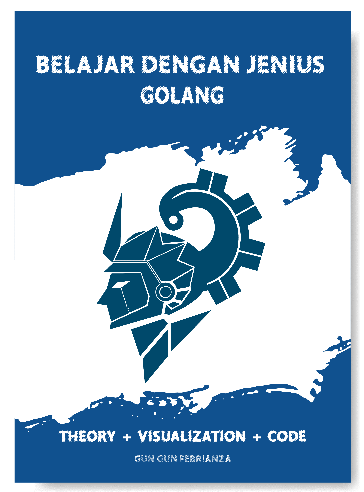

# Belajar-Dengan-Jenius-Golang
Buku Belajar Dengan Jenius Golang

Table of Contents
Contents
Open Library Indonesia	3
Table of Contents	5
Chapter 1	18
Computer	18
Subchapter 1 – Komputer & Pemograman	18
	1. Computer Program	20
	2. Computation	20
	3. Computer Organization	20
		Input Unit	21
		Output Unit	21
		Memory Unit	21
		Arithmetic and Logic Unit (ALU)	21
		Central Processing Unit (CPU)	22
		Secondary Storage Unit	22
	4. Data Hierarchy	22
		Bit	23
		Byte	23
		Bytes	23
		Character	23
		Field	26
		Record	26
		Files	27
		Database	27
		Big Data	27
	5. Operating System	29
	6. Programming Language	30
	7. Programming Language Abstraction	31
		Machine Language	31
		Assembly Language	32
		High Level Language	33
		Compiled Language	35
		Interpreted Language	35
		Hybrid Language	35
Subchapter 2 – Kompiler & Interpreter	37
	1. Compiler	37
		Self-hosting Compiler	37
		Assembler	38
		Cross-compiler	38
		Just-in-Time Compiler	38
		Decompiler	39
	2. Interpreter	40
	3. Compilation Process	43
		Source Code	44
		Lexical Analyzer	45
		Syntax Analyzer	46
		Symbol Table	46
		Intermediate Code Generator	47
		Bytecode	47
		Semantic Analyzer	49
		Optimization	49
		Code Generator	49
	4. Runtime Infrastructure	51
		JVM & CLR	51
		Two-stage Translation	52
		Object Code	53
		Linker	54
		Loader	54
Chapter 2 ✓	55
Setup Learning Environment ✓	55
Subchapter 1 – Visual Studio Code ✓	55
	1. Install Programming Language Support	58
	2. Install Keybinding	59
	3. Install & Change Theme Editor	61
	4. The File Explorer	62
	5. Search Feature	64
	6. Source Control	66
	7. Debugger	68
	8. Extension	68
		Auto Fold	68
		Bookmarks	69
		Path Intellisense	72
		VSCode Great Icons	72
		Better Comment	72
	9. The Terminal	74
		Menambah Terminal Baru	74
		Melakukan Split Terminal	75
		Mengubah Posisi Terminal	75
		Menghapus Terminal	76
	10. Zen Mode	77
	11. Display Multiple File	78
	12. Font Ligature	79
Subchapter 2 – Go Lang ✓	82
	1. Go Lang Installation	82
	2. Check Golang Version	83
Chapter 3 ✓	84
Mastering Go Lang ✓	84
Subchapter 1 – Introduction to Go Lang ✓	84
	1.	Go is Compiled Language	86
			Static Linking	86
			Go Compiler	87
	2.	Go is Safe Language	88
			Statically Typed & Type-safe Memory	88
			Garbage Collection	88
			Unicode	88
	3.	Go is Multicore Programming	89
Subchapter 2 – Setup Go Lang ✓	91
	1.	Configure GOPATH	91
			Setup GOPATH for Windows	92
			Setup GOPATH for MacOS	92
			Setup GOPATH for Linux	93
			Folder bin	93
			Folder pkg	93
			Folder src	94
	2.	Go Compilation	95
	3.	Go Execution	97
	4.	Go Documentation	98
	5.	Go Playground	99
Subchapter 3 – Go Program ✓	100
	1.	Basic Structure	100
		Package Name	101
		Imported Package	101
		Entrypoint	101
	2.	Comment	102
	3.	Expression & Operator	103
			Statement	103
			Expression	104
			Operator Precedence	104
			Block of Code	105
			Operator & Operand	105
			Arithmetic Operator	106
			Arithmetic Operation	106
			Comparison Operator	108
			Logical Operator	109
			Assignment Operator	112
	4.	String	113
	5.	Rune	114
	6.	Numbers	115
	7.	Boolean	116
	8.	Import Package	117
	9.	Variable Declaration	118
			Variable	118
			Binding	120
			Reserved Words	120
			Naming Convention	121
			Case Sensitivity	123
			Var Keyword	125
			Constant Keyword	126
			Zero Value	127
			Short-Variable Declaration	127
			Multiple-variable Declaration	128
Subchapter 4 – Data Types ✓	129
	1.	Apa itu Data?	129
	2.	Apa itu Types?	130
	3.	Apa itu Data Types?	130
			uint8 Case Study	131
			int8 Case Study	133
	4.	Apa itu Strongly & Dynamically Typed?	135
	5.	Go Data Types	136
			Numeric Data Types	136
			String Data Types	150
			Booleans Data Types	153
			Check Data Types	154
			Apa itu Stack & Heap?	155
	6.	Data Types Conversion	156
			int To float64	157
			float64 To int	157
			Int To String	158
			String to Int	158
			String to Float	159
			Int to Int64	159
Subchapter 5 – Control Flow ✓	161
	1.	Block Statements	161
	2.	Conditional Statements	162
	3.	Multiconditional Statement	164
	4.	Switch Style	165
Subchapter 6 – Loop & Iteration ✓	166
	1.	For Statement	167
	2.	Range Statement	170
	3.	Break Statement	172
	4.	Continue Statement	173
Subchapter 7 – Function ✓	174
	1.	Introduction to Function	174
			First Class Function	174
			First-class Citizen	175
			Higher-order Functions	175
			Function of Function	175
			Function Structure	176
	2.	Practice Function	178
			Basic Function	178
			Function Parameter	179
			Function Arguments	179
			Function Return	179
			Function Multiple Return	180
			Function Named Return	180
			First-class Citizen	181
			Variadic Function	182
			Anonymous Function	182
			Closure	183
			Defer	185
Subchapter 8 – Error Handling ✓	188
	1.	Syntax Error	189
			Missing Syntax	189
			Invalid Syntax	190
	2.	Logical Error	191
	3.	Runtime Error	193
	4.	Error Package	194
			Log Package	194
			Fatal & Exit	196
	5.	Panic & Recover	197	
Subchapter 9 – Composite Types ✓	199
	1.	Apa itu Pointer?	201
			De-referencing	201
			Read Memory Address	201
			Pointer Variable	202
			Store Memory Address	202
			Access Pointer Variable	202
			Pointer As Parameter	203
			Passing By Value	204
			Passing By Pointer	205
			Nil Value	205
			Pointer Template String	207
	2.	Struct	209
			Create Struct	210
			Declare Custom Type	211
			Read Struct Field	211
			Struct As Parameter	212
			Struct As Pointer	212
			Nested Struct	213
			Add Method to Struct	214
	3.	Interface	216
			Evaluation – Learning Metrics	219
Subchapter 10 – Data Structure ✓	222
	1.	Array	223
			Create Fixed-length Array	224
			Create Array with Ellipses	224
			Access Array Element	224
			Modify Array Element	224
			Read Array Length	224
			Looping Array	224
			Multidimensional Array	224
			Looping Multidimensional Array	224
	2.	Slice	225
			Create Slice	225
			Create Sub-slice	226
			Low & High Expression	226
			Reference Type	227
			Append to Slice	227
			Copy Slice	228
			Looping Slice	228
	3.	Map	230
			Create Map	230
			Check Map Types	231
			Read Map Length	231
			Add Element	232
			Read Element	232
			Modify Element	233
			Delete Element	233
			Looping Map	234
			Truncate Map	235
			Sorting Map By Key	235
			Sorting Map By Values	237
			Merging Map	238
			References	240
Tentang Penulis	242

