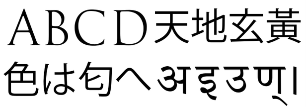
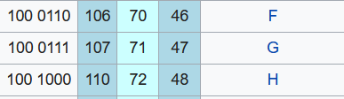
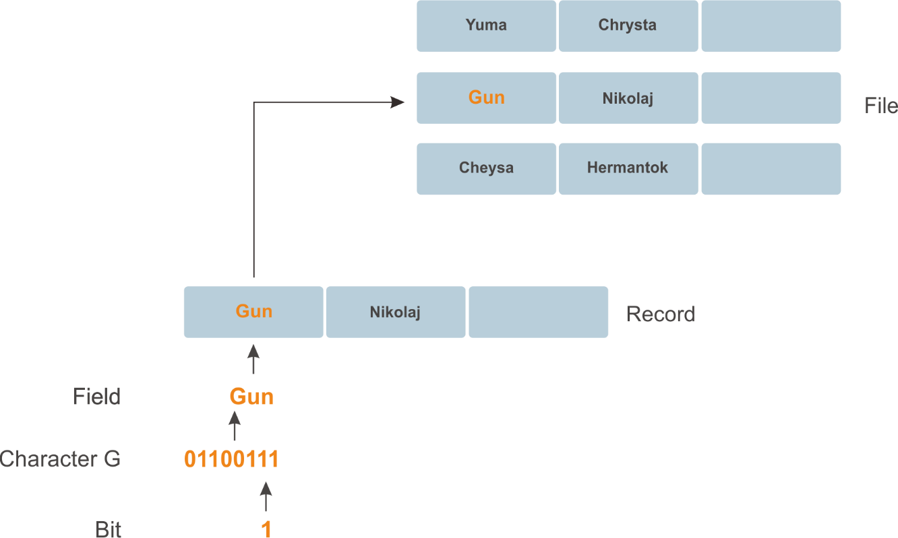

# Belajar Dengan Jenius Golang

## Penulis : Gun Gun Febrianza

## *Data Hierarchy*

Data yang akan diproses oleh komputer memiliki bentuk data hirarki, mulai dari yang paling kecil dan tidak dapat dibagi yaitu bits sampai ke dalam bentuk yang lebih kompleks

### *Bit*

Bit adalah kependekan dari **Binary Digit**, unit terkecil sebuah informasi dalam mesin komputer. Satu buah *bit* dapat menampung dua nilai diantaranya adalah **0** atau **1**. 

Jika terdapat 8 *bit* maka kita dapat menyebutnya sebagai **1 byte**.

### *Byte*

*Byte* adalah kependekan dari **Binary Term**, sebuah unit penyimpanan yang sudah memiliki kapabilitas paling sederhana untuk menyimpan sebuah karakter tunggal. 

1 *byte* = sekumpulan *bit* (terdapat delapan bit). Contoh : 0 1 0 1 1 0 1 0

1 *byte* dapat menyimpan karakter contoh : 'A' atau 'x' atau '$'

### *Bytes*

*Byte* adalah unit yang dipat digunakan untuk menyimpan informasi, seluruh penyimpanan diukur menggunakan *bytes*.

| **Number of Bytes**  | **Unit**         | **Representation**      |
| -------------------- | ---------------- | ----------------------- |
| 1                    | *Byte*           | *One Character*         |
| 1024                 | *KiloByte (Kb)*  | *Small Text In notepad* |
| 1,048,576            | *MegaByte (Mb)*  | *Ebook*                 |
| 1,073,741,824        | *GigaByte (Gb)*  | *Movie*                 |
| 1,099,511,627,776    | *TeraByte (Tb)*  | *Archive*               |
| *Approximately* 1015 | *PetaByte (Pb)*  | *Big Data*              |
| *Approximately* 1018 | *ExaByte (Eb)*   | *Big Data*              |
| *Approximately* 1021 | *ZettaByte (Zb)* | *Big Data*              |

### *Character*

Data dalam bentuk *bits* tidak mudah untuk dikelola sehingga perlu bentuk lain yang dapat digunakan manusia dan mempermudah proses pengelolaan informasi. Untuk mewujudkan hal tersebut data dalam *bits* harus bisa direpresentasikan dalam bentuk *character*. Seperti *decimal* *digit* (0-9), *letter* (A-Z dan a-z), dan *special symbol* (!@#$%^&*()-=_+). *Digit, letter* dan *symbol* disebut dengan *characters*. 

**Characters Set** adalah sekumpulan *characters* yang digunakan untuk menulis program dan merepresentasikan sebuah informasi. Dikarenakan komputer memproses informasi dalam bentuk 1 dan 0, maka sebuah *character* dapat direpresentasikan menggunakan 1 dan 0.

*Character* adalah unit terkecil dalam sistem teks dan memiliki makna. 

Sekumpulan *character* dapat membentuk *string* yang selanjutnya dapat digunakan untuk memvisualisasikan suatu bahasa verbal secara digital. Contoh *character* adalah abjad, angka dan simbol lainya. 

#### *ASCII*

Komputer merepresentasikan sebuah data dengan *number*, di awal pengembangan komputer tepatnya sekitar tahun 1940. Penggunaan teks dalam komputer untuk disimpan dan dimanipulasi dapat dilakukan, dengan cara merepresentasikan abjad dalam alfabet menggunakan *number*. Sebagai contoh angka 65 merepresentasikan huruf A dan angka 66 merepresentasikan huruf B hingga seterusnya.

Pada tahun 1950 saat komputer sudah semakin banyak digunakan untuk berkomunikasi, standar untuk merepresentasikan *text* agar dapat difahami oleh berbagai model dan *brand* komputer diusung. 

*ASCII* (*American Standard Code for Information Interchange*) adalah karya yang diusung, pertama dipublikasikan pada tahun 1963. Saat pertama kali dipublikasikan *ASCII* masih digunakan untuk *teleprinter technology*. *ASCII* terus direvisi hingga akhirnya *7-bit ASCII Table* diadopsi oleh *American National Standards Institute* (*ANSI*).

Dengan *7-bit* maka terdapat 128 *unique binary pattern* yang dapat digunakan untuk merepresentasikan suatu karakter. Kita dapat merepresentasikan **alphanumeric** (abjad a-z, A-Z, angka 0-9, dan *special character* seperti “!@#$%^&*”). 

Pada gambar di bawah ini huruf kapital G memiliki representasi dalam bentuk biner 100 0111 (7 *binary digit*) dan huruf kapital F memiliki representasi dalam bentuk *binary pattern* 100 0110 : 

Pada huruf kapital G angka 107 adalah representasi dalam *octal numeral system*, angka 71 adalah representasi dalam *decimal numeral system* dan angka 46 adalah representasi dalam *hexadecimal*. Representasi tidak hanya dalam bentuk *binary*. Untuk *table ASCII* lebih lengkapnya anda dapat melihat di wikipedia.

*Character* hanya merepresentasikan sekumpulan *bit*, *field* merepresentasikan serangkaian *character* atau *bytes* yang memiliki makna lebih luas. Misal sebuah *field* dapat digunakan untuk merepresentasikan nama seseorang atau umur seseorang.

### *Field*

### *Record*

Beberapa *field* yang saling berhubungan atau memiliki kesamaan dapat digunakan untuk membangun suatu *record*. Misalkan dalam sistem kependudukan, anda tentu memiliki beberapa *fields* diantaranya adalah nama, tempat & tanggal lahir, jenis kelamin, status dan sebagainya. Ketika masing-masing *field* terisi maka kita akan membentuk suatu *record*.

### *Files*

Secara umum sebuah *file* dapat berupa ***arbitrary data\*** dengan ***arbitrary format\***. Sebagai contoh dengan ***notepad.exe\*** kita dapat membuat sebuah tulisan berisi ***plaintext\*** kemudian menyimpanya ke berbagai format seperti, **.txt, .md, .html** atau bahkan menyimpanya dengan format yang tidak dikenali oleh program dalam suatu sistem operasi (misal dengan format .**xxxasdqwe**).

Di beberapa sistem operasi sebuah *file* dikatakan dengan serangkaian *bytes* yang membentuk suatu *file*.

### *Database*

*Database* adalah sekumpulan data yang teroganisir dengan baik agar bisa diakses dan dimanipulasi. Model pembuatan *database* yang paling terkenal adalah *relational database*, data disimpan ke dalam sebuah *table* yang berisi *record* dan *fields*.

### *Big Data*

***Big Data\*** adalah terminologi yang menjelaskan sebuah fenomena data dengan *volume* yang sangat besar (*High Volume Data*), data dengan struktur yang bervariasi (*High Varied Data*) dan data diproduksi dengan kecepatan yang sangat tinggi (*High Velocity Data*). 

Ketersediaan internet, kecepatan internet, *web application* dan produksi perangkat elektronik seperti *smartphone*, komputer, laptop dan *tablet* menciptakan ledakan data dengan pertumbuhan yang sangat cepat.

Dengan 2,4 milyar pengguna aktif pada kuarter kedua tahun 2019 *facebook* menjadi *platform* jejaring sosial (*social media*) terbesar didunia. Sebuah *platform social media*, dapat memproduksi berbagai jenis data seperti gambar (*image*), vidio (*video*), teks (*text*) dan suara (*voice*) dengan kecepatan yang sangat tinggi.

------------------------

